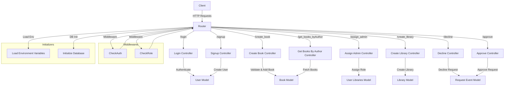

```mermaid
graph TD
    A[Client] -->|HTTP Requests| B[Router]
    B -->|/login| C[Login Controller]
    B -->|/signup| D[Signup Controller]
    B -->|/create_book| E[Create Book Controller]
    B -->|/assign_admin| F[Assign Admin Controller]
    B -->|/create_library| G[Create Library Controller]
    B -->|/get_books_byAuthor| H[Get Books By Author Controller]
    B -->|/decline| I[Decline Controller]
    B -->|/approve| J[Approve Controller]

    C -->|Authenticate| K[User Model]
    D -->|Create User| K
    E -->|Validate & Add Book| L[Book Model]
    F -->|Assign Role| M[User Libraries Model]
    G -->|Create Library| N[Library Model]
    H -->|Fetch Books| L
    I -->|Decline Request| O[Request Event Model]
    J -->|Approve Request| O

    subgraph Middlewares
        P[CheckAuth]
        Q[CheckRole]
    end

    B -->|Middleware| P --> B
    B -->|Middleware| Q --> B

    subgraph Initializers
        R[Load Environment Variables]
        S[Initialize Database]
    end

    B -->|Load Env| R
    B -->|DB Init| S
```